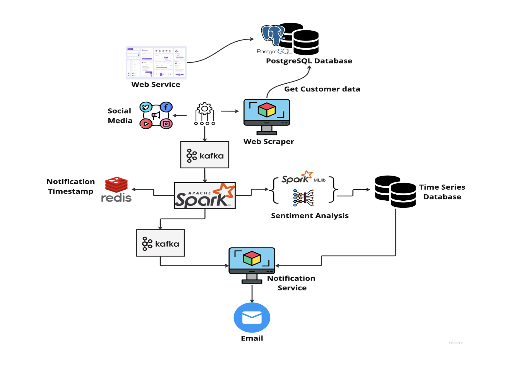

# BrandPulse

## Title and list of project participants:

1. Title: BrandPulse.ai

2. List of participants:
- Akshay Bakshi 
- Naveena Ganesan 
- Tarun Annapareddy

## Project Overview:

The world is evolving rapidly, and so are businesses. In this dynamic environment, companies are compelled to make swift decisions and want to gain insights into how these decisions are perceived by the public. To address this need, we propose the development of a brand monitoring and analytics tool - BrandPulse.ai. This tool will collect data from various sources, including Twitter and LinkedIn, and perform sentiment analysis and provide periodic notifications. BrandPulse.ai will track changes in public sentiment towards your company over time and monitor conversations about your competitors.

## Use Cases:

- How are people reacting to Twitter's name change to X?
- What is the public perception of Meta's introduction of threads?

## Project Goal:

- Learn how people are talking about customer across web and social media
- Keep track of changing public sentiment and support
- Notify customer when someone talk about them online

## Product Usage:

1. Register your company with us by providing your company name, email, and mobile contact for notification purposes.
2. We will continuously scrape data about your company, and conduct sentiment analysis for both your company and your competitors.
3. You will receive regular reports on sentiment trends over weekly or monthly intervals, along with insights into what decisions may have influenced these shifts.

